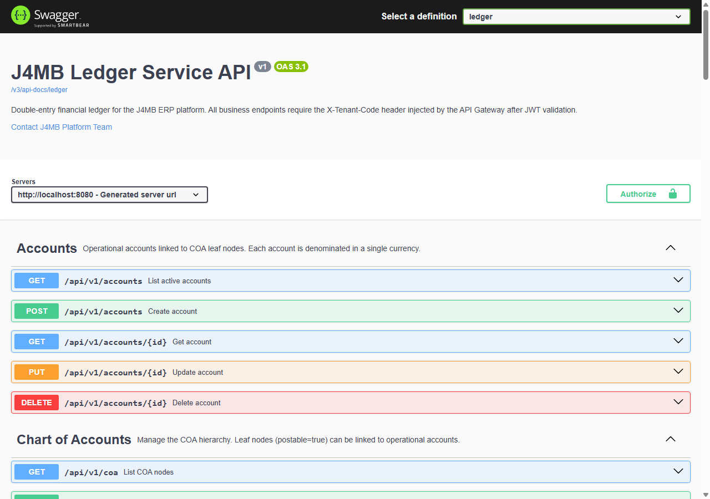
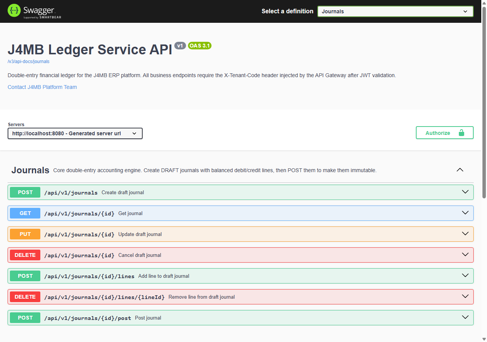
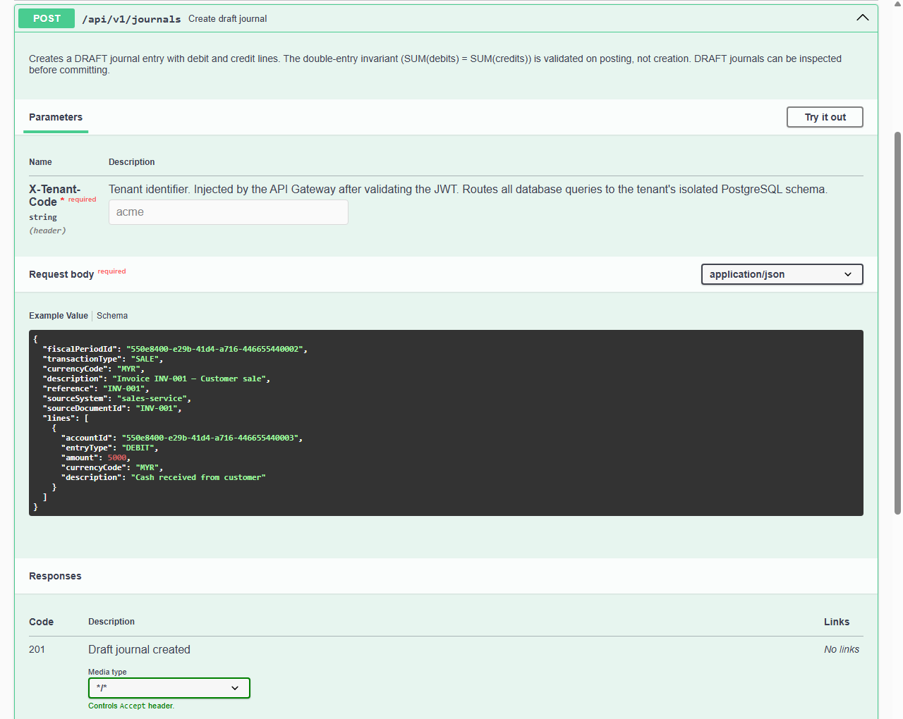

# j4mb-ledger

Event-driven double-entry ledger service built with Spring Boot and PostgreSQL.

`j4mb-ledger` is the financial core of the J4MB ERP platform: a multi-tenant
double-entry accounting engine that manages a chart of accounts, posts balanced
journal entries, tracks fiscal periods and multi-currency balances, and keeps
an immutable audit trail — with each tenant isolated in its own PostgreSQL
schema.

---

## Key Features

- **Double-entry journal engine** — journals are created as balanced `DRAFT`
  entries (debit lines and credit lines), validated so `SUM(debits) = SUM(credits)`,
  and only become immutable once explicitly posted. Draft journals can have
  lines added/removed or be cancelled before posting.
- **Chart of Accounts (COA)** — hierarchical COA with postable leaf nodes;
  operational accounts are linked to a COA leaf node and denominated in a
  single currency.
- **Fiscal periods & closing** — fiscal period management plus period-end and
  year-end closing/reopening/locking workflows.
- **Multi-currency support** — tenant currency configuration with a
  designated base currency, and exchange rate management.
- **Posting rules** — configurable rules that drive how transactions are
  translated into journal lines.
- **Balance projections** — running account balances derived from posted
  journal activity.
- **Audit trail** — an append-only audit log for financial activity.
- **Multi-tenant by schema** — every tenant is provisioned into its own
  PostgreSQL schema (schema-per-tenant), resolved per-request from an
  `X-Tenant-Code` header injected by an upstream API gateway after JWT
  validation. A platform-level `TenantProvisioningService` creates and
  migrates each new tenant's schema on demand.

## Tech Stack

| Layer | Choice |
|---|---|
| Language | Java 21 |
| Framework | Spring Boot 3.5 (Web, Validation, Data JPA, Actuator) |
| Persistence | Hibernate 6 / PostgreSQL 16, schema-per-tenant multi-tenancy |
| Migrations | Flyway — split into `platform/` and `tenant/` migration paths |
| API docs | springdoc-openapi (OpenAPI 3.1 / Swagger UI), grouped by domain |
| Testing | JUnit 5, Spring Boot Test, Testcontainers (PostgreSQL), ArchUnit |
| Build | Maven (wrapper included), enforced via maven-enforcer-plugin |
| Local infra | Docker Compose (PostgreSQL) |

No Lombok — enforced both by `maven-enforcer-plugin` (banned dependency) and
an ArchUnit rule; domain models use plain constructors/records.

## Architecture

The service is organized as a set of domain-oriented (bounded-context)
packages, each following the same internal layering:

```
com.j4mb.ledger/
├── account/       operational accounts
├── coa/            chart of accounts hierarchy
├── journal/        double-entry journals & posting
├── posting/        posting rules
├── balance/        account balance projections
├── fiscal/         fiscal periods & year/period closing
├── closing/        closing workflow API
├── currency/       tenant currencies & exchange rates
├── audit/          audit trail
├── provisioning/   tenant provisioning (schema creation + migration)
├── platform/       platform-level tenant registry
├── tenant/         Hibernate multi-tenancy plumbing
└── shared/         cross-cutting context, exceptions, base API types
```

Each domain package follows a consistent internal split —
`api` (controllers/DTOs) → `service` (business logic) → `domain` (entities/value
objects) → `repository` (Spring Data JPA) — and this layering is enforced by an
ArchUnit test suite (`ArchitectureTest`), which asserts:

- domain classes never depend on infrastructure or `org.springframework.web`
- domain classes never call repositories directly
- controllers never call repositories directly (must go through a service)
- no Lombok anywhere in the codebase

**Multi-tenancy** is implemented at the Hibernate level: a
`TenantIdentifierResolver` reads the current tenant from request context and a
`SchemaMultiTenantConnectionProvider` switches the active PostgreSQL schema
per request. Flyway migrations are split into a `platform` location (run
automatically at startup — tenant registry, schema template) and a `tenant`
location (run programmatically by `TenantMigrator` once per newly provisioned
tenant schema).

## Running Locally

Requirements: JDK 21+, Docker (for PostgreSQL).

```bash
# 1. Copy the sample env file (defaults are fine for local dev)
cp .env.sample .env

# 2. Start PostgreSQL
docker compose up -d

# 3. Run the service (Maven Wrapper — no local Maven install needed)
./mvnw spring-boot:run       # Linux/macOS
mvnw.cmd spring-boot:run     # Windows
```

The service starts on `http://localhost:8080`. Platform-schema Flyway
migrations run automatically on startup.

### Running tests

```bash
./mvnw test      # unit tests + ArchUnit architecture rules
./mvnw verify     # + integration tests (Testcontainers-backed, needs Docker)
```

## API Documentation

With the service running, interactive API docs are available via Swagger UI:

- Swagger UI: `http://localhost:8080/swagger-ui.html`
- OpenAPI JSON: `http://localhost:8080/v3/api-docs`

The API is split into grouped OpenAPI documents per domain (Accounts, Chart of
Accounts, Currencies, Exchange Rates, Fiscal, Journals, Period & Year Closing,
Posting Rules, plus an Internal Admin group), selectable from the "Select a
definition" dropdown in Swagger UI. Every business endpoint requires an
`X-Tenant-Code` header, which in production is injected by the upstream API
gateway after JWT validation.

### Screenshots

**API overview** — all domain groups (Accounts, Chart of Accounts, Currencies, ...):



**Journals group** — the double-entry journal lifecycle (draft → add/remove lines → post → cancel):



**Create journal** — request schema showing a balanced double-entry payload:



## License

MIT — see [LICENSE](LICENSE).
