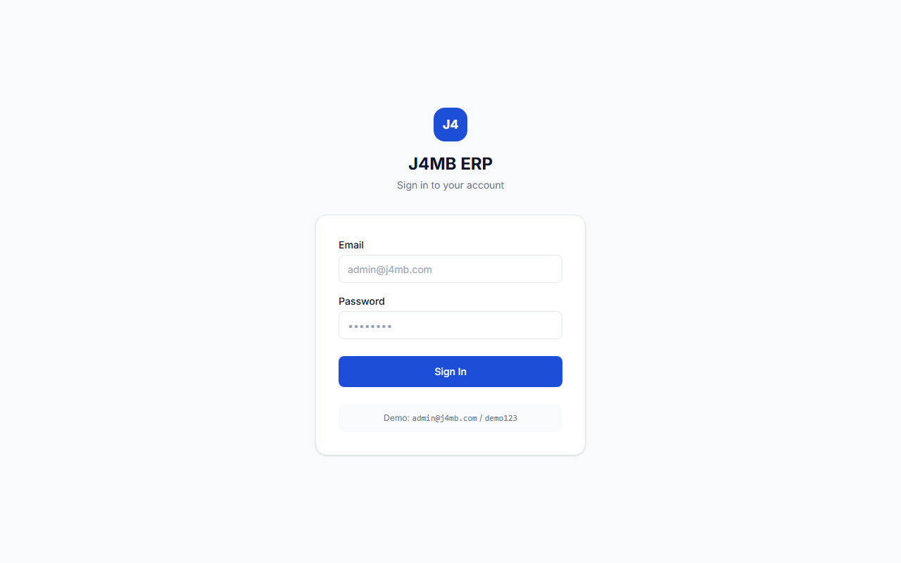
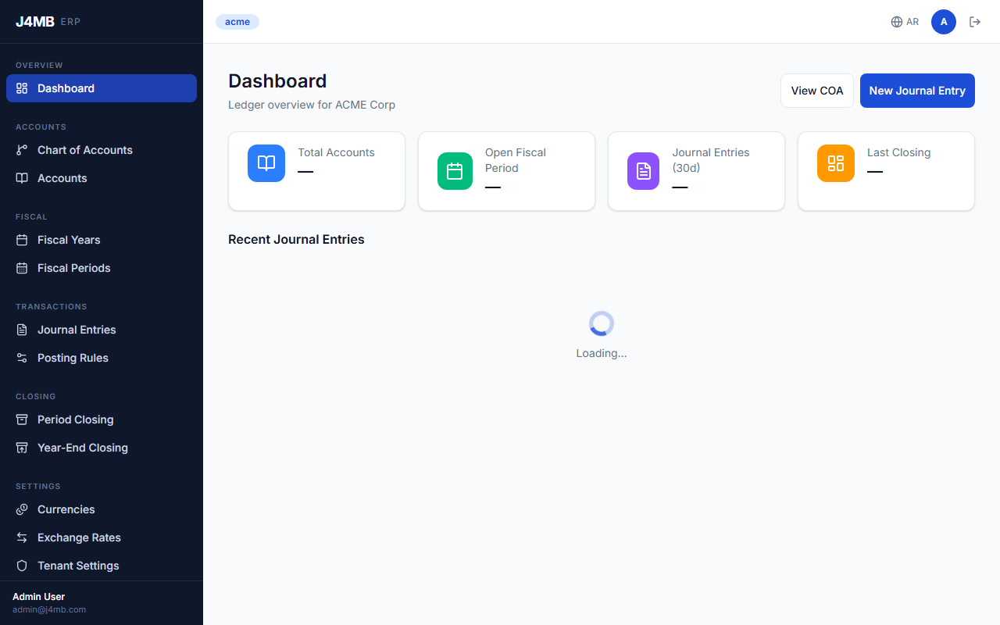
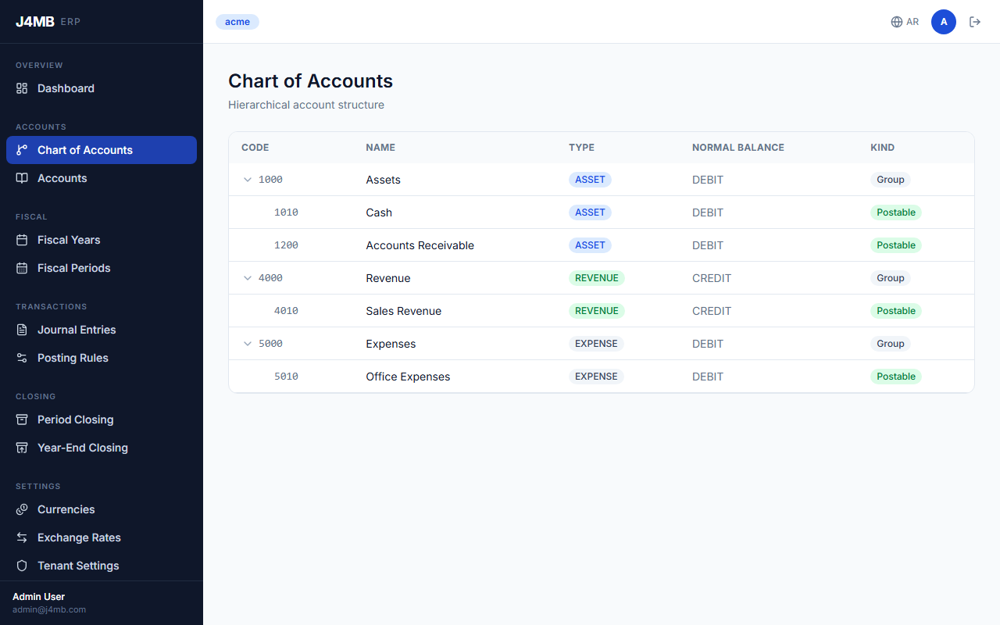
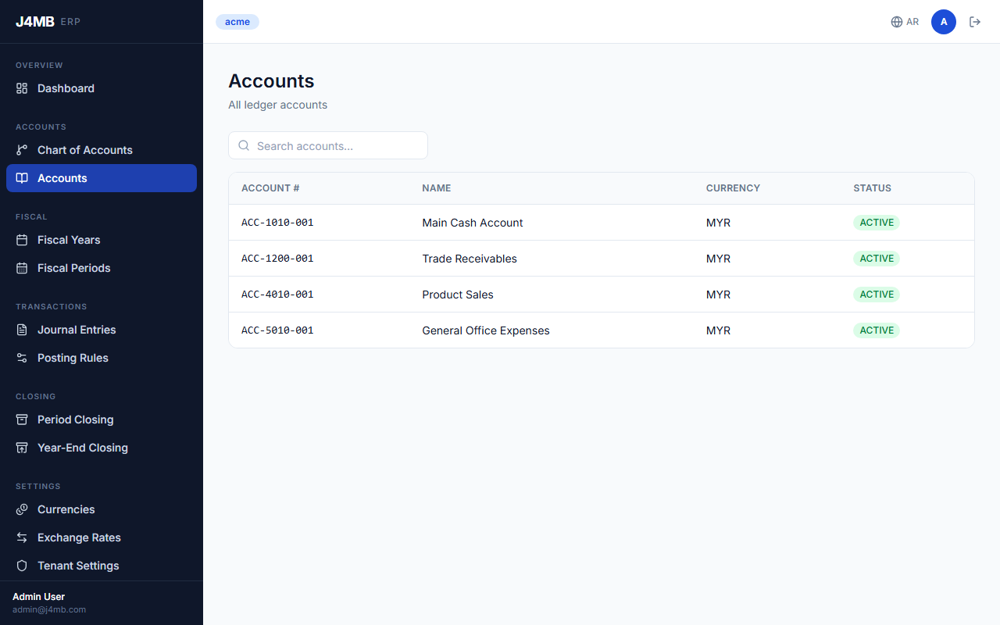
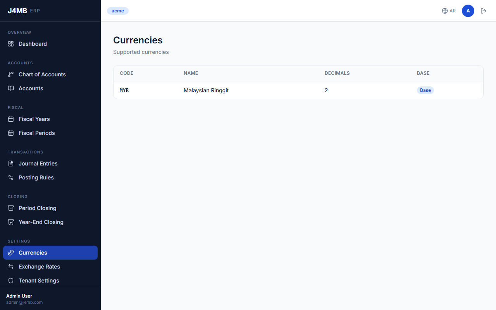
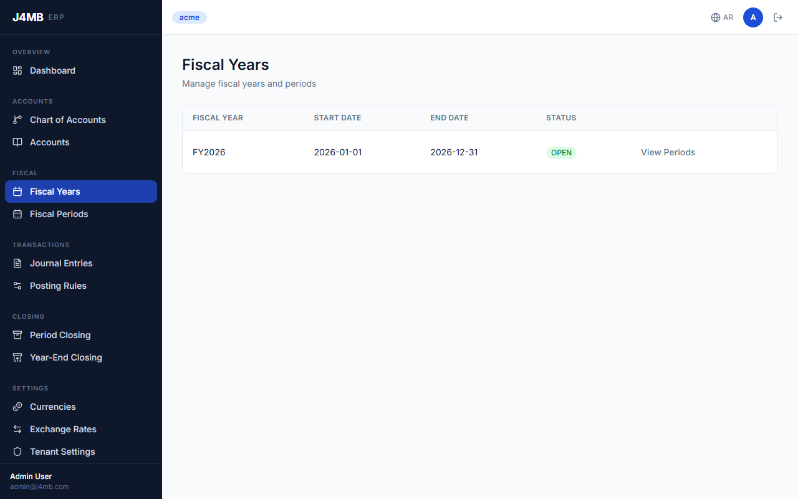
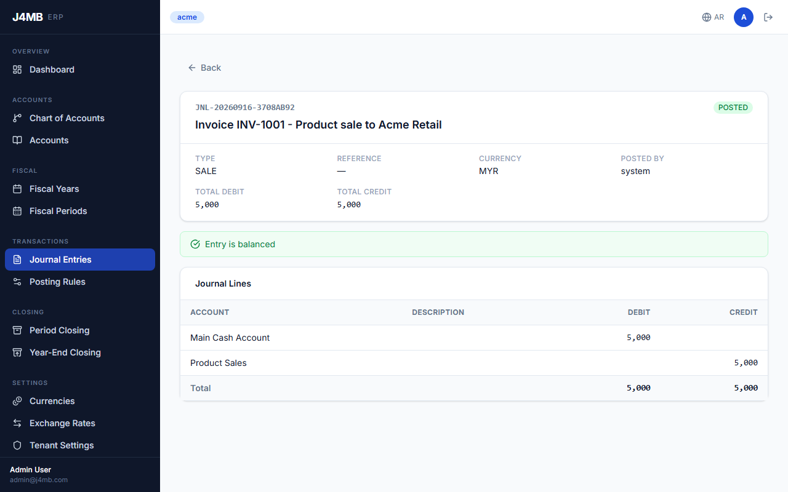
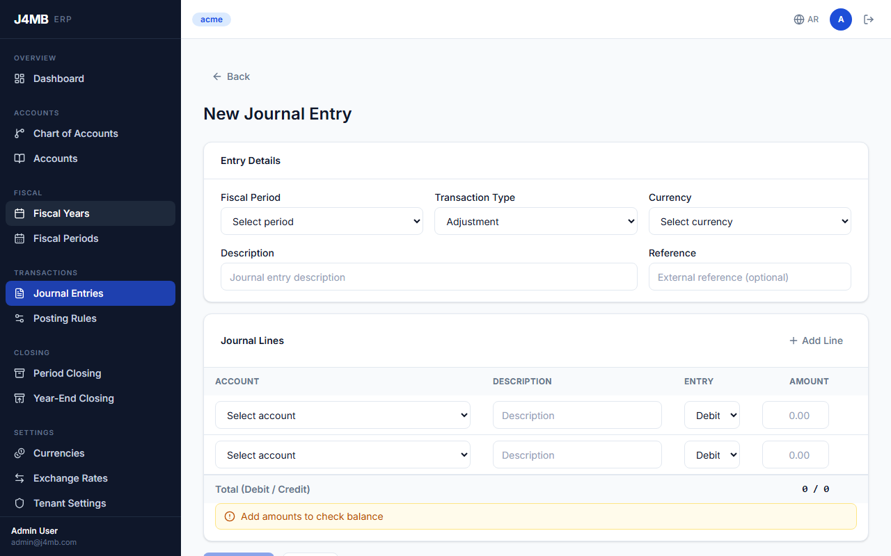

# j4mb-ledger

Event-driven double-entry ledger service built with Spring Boot and PostgreSQL.

`j4mb-ledger` is the financial core of the J4MB ERP platform: a multi-tenant
double-entry accounting engine that manages a chart of accounts, posts balanced
journal entries, tracks fiscal periods and multi-currency balances, and keeps
an immutable audit trail — with each tenant isolated in its own PostgreSQL
schema.

---

## Key Features

- **Double-entry journal engine** — journals are created as balanced `DRAFT`
  entries (debit lines and credit lines), validated so `SUM(debits) = SUM(credits)`,
  and only become immutable once explicitly posted. Draft journals can have
  lines added/removed or be cancelled before posting.
- **Chart of Accounts (COA)** — hierarchical COA with postable leaf nodes;
  operational accounts are linked to a COA leaf node and denominated in a
  single currency.
- **Fiscal periods & closing** — fiscal period management plus period-end and
  year-end closing/reopening/locking workflows.
- **Multi-currency support** — tenant currency configuration with a
  designated base currency, and exchange rate management.
- **Posting rules** — configurable rules that drive how transactions are
  translated into journal lines.
- **Balance projections** — running account balances derived from posted
  journal activity.
- **Audit trail** — an append-only audit log for financial activity.
- **Multi-tenant by schema** — every tenant is provisioned into its own
  PostgreSQL schema (schema-per-tenant), resolved per-request from an
  `X-Tenant-Code` header injected by an upstream API gateway after JWT
  validation. A platform-level `TenantProvisioningService` creates and
  migrates each new tenant's schema on demand.

## Tech Stack

| Layer | Choice |
|---|---|
| Language | Java 21 |
| Framework | Spring Boot 3.5 (Web, Validation, Data JPA, Actuator) |
| Persistence | Hibernate 6 / PostgreSQL 16, schema-per-tenant multi-tenancy |
| Migrations | Flyway — split into `platform/` and `tenant/` migration paths |
| API docs | springdoc-openapi (OpenAPI 3.1 / Swagger UI), grouped by domain |
| Testing | JUnit 5, Spring Boot Test, Testcontainers (PostgreSQL), ArchUnit |
| Build | Maven (wrapper included), enforced via maven-enforcer-plugin |
| Local infra | Docker Compose (PostgreSQL) |

No Lombok — enforced both by `maven-enforcer-plugin` (banned dependency) and
an ArchUnit rule; domain models use plain constructors/records.

## Architecture

The service is organized as a set of domain-oriented (bounded-context)
packages, each following the same internal layering:

```
com.j4mb.ledger/
├── account/       operational accounts
├── coa/            chart of accounts hierarchy
├── journal/        double-entry journals & posting
├── posting/        posting rules
├── balance/        account balance projections
├── fiscal/         fiscal periods & year/period closing
├── closing/        closing workflow API
├── currency/       tenant currencies & exchange rates
├── audit/          audit trail
├── provisioning/   tenant provisioning (schema creation + migration)
├── platform/       platform-level tenant registry
├── tenant/         Hibernate multi-tenancy plumbing
└── shared/         cross-cutting context, exceptions, base API types
```

Each domain package follows a consistent internal split —
`api` (controllers/DTOs) → `service` (business logic) → `domain` (entities/value
objects) → `repository` (Spring Data JPA) — and this layering is enforced by an
ArchUnit test suite (`ArchitectureTest`), which asserts:

- domain classes never depend on infrastructure or `org.springframework.web`
- domain classes never call repositories directly
- controllers never call repositories directly (must go through a service)
- no Lombok anywhere in the codebase

**Multi-tenancy** is implemented at the Hibernate level: a
`TenantIdentifierResolver` reads the current tenant from request context and a
`SchemaMultiTenantConnectionProvider` switches the active PostgreSQL schema
per request. Flyway migrations are split into a `platform` location (run
automatically at startup — tenant registry, schema template) and a `tenant`
location (run programmatically by `TenantMigrator` once per newly provisioned
tenant schema).

## Running Locally

Requirements: JDK 21+, Docker (for PostgreSQL).

```bash
# 1. Copy the sample env file (defaults are fine for local dev)
cp .env.sample .env

# 2. Start PostgreSQL
docker compose up -d

# 3. Run the service (Maven Wrapper — no local Maven install needed)
./mvnw spring-boot:run       # Linux/macOS
mvnw.cmd spring-boot:run     # Windows
```

The service starts on `http://localhost:8080`. Platform-schema Flyway
migrations run automatically on startup.

### Running tests

```bash
./mvnw test      # unit tests + ArchUnit architecture rules
./mvnw verify     # + integration tests (Testcontainers-backed, needs Docker)
```

## API Documentation

With the service running, interactive API docs are available via Swagger UI:

- Swagger UI: `http://localhost:8080/swagger-ui.html`
- OpenAPI JSON: `http://localhost:8080/v3/api-docs`

The API is split into grouped OpenAPI documents per domain (Accounts, Chart of
Accounts, Currencies, Exchange Rates, Fiscal, Journals, Period & Year Closing,
Posting Rules, plus an Internal Admin group), selectable from the "Select a
definition" dropdown in Swagger UI. Every business endpoint requires an
`X-Tenant-Code` header, which in production is injected by the upstream API
gateway after JWT validation.

### Screenshots

**API overview** — all domain groups (Accounts, Chart of Accounts, Currencies, ...):


**Journals group** — the double-entry journal lifecycle (draft → add/remove lines → post → cancel):


**Create journal** — request schema showing a balanced double-entry payload:


## Frontend

`frontend/` is a React SPA (Vite, TypeScript, TanStack Query, Tailwind, Radix UI)
that consumes this API directly — a role-based shell (staff-style ERP UI) over
Chart of Accounts, Accounts, Currencies/Exchange Rates, Fiscal Years/Periods,
and Journal Entries.

It ships with a mock-service-worker layer (`VITE_USE_MOCK=true`) for
frontend-only development, and can be pointed at a real running instance of
this backend (`VITE_USE_MOCK=false`) — the screenshots below are all real,
captured against a live backend with seeded demo data, not the mocks.

### Running it against this backend

```bash
cd frontend
npm install
cp .env .env.local   # or edit .env directly — VITE_API_BASE_URL, VITE_USE_MOCK
npm run dev
```

The backend needs two things the frontend assumes are already in place for
local dev, since there's no API gateway in front of it yet:

1. **CORS** — `CorsConfig` allows `http://localhost:5173` (the Vite dev
   server's default port) to call this API directly.
2. **A provisioned tenant** — sign-in is a hardcoded demo credential
   (`admin@j4mb.com` / `demo123`, see `AuthContext`) that assigns tenant code
   `acme`; the tenant itself has to exist first via the internal provisioning
   endpoint:

   ```bash
   curl -X POST http://localhost:8080/internal/admin/tenants \
     -H "Content-Type: application/json" \
     -d '{"tenantCode":"acme","tenantName":"Acme Corporation","provisionedBy":"admin@j4mb.com"}'
   ```

### Screenshots

All captured from the real app running against this backend (tenant `acme`,
seeded chart of accounts, accounts, and journal entries):

| Login | Dashboard |
|---|---|
|  |  |

| Chart of Accounts | Accounts |
|---|---|
|  |  |

| Currencies | Fiscal Years |
|---|---|
|  |  |

| Posted Journal | New Journal Entry |
|---|---|
|  |  |

### Known gaps (frontend built ahead of the backend)

The frontend was originally built against an assumed API contract before this
backend existed in its current form. Wiring it up for real surfaced several
mismatches — most were fixed (see below), a few are genuine backend feature
gaps that are out of scope for a "wire the frontend up" pass:

- **No dashboard summary endpoint.** The dashboard's stat tiles and "recent
  journals" widget call `/api/v1/dashboard/*`, which doesn't exist on this
  backend — they render as `—` rather than crashing.
- **No journal list / closing list endpoints.** There's no `GET
  /api/v1/journals` (only `GET /api/v1/journals/{id}` — you can view a journal
  you already have the ID for, e.g. from a future audit or search feature, but
  not browse all of them yet) and no `GET /api/v1/closing` at all (the actual
  close/reopen/lock actions live under `/api/v1/fiscal/...` instead).
- **Accounts list has no server-side filtering.** `GET /api/v1/accounts` only
  accepts pagination — the search box filters client-side over the current
  page instead.
- **No account balance endpoint.** The `balance` domain package exists but
  isn't exposed via any controller yet, so accounts don't show a running
  balance in the UI.

What *was* actually broken and got fixed while wiring this up: the API client
never unwrapped this backend's `{success, data, error}` response envelope; the
COA, Currencies, Exchange Rates, and Fiscal Years/Periods endpoints return
plain arrays rather than the paginated shape the frontend assumed; the COA
endpoint is a lazy per-level tree (`?parentId=`), not a single full-tree
response; several DTO field names didn't match the real backend
(`Account.code` vs `accountNumber`, `FiscalYear.name` vs `yearName`, journal
lines' split `debitAmount`/`creditAmount` vs the real `entryType` + `amount`,
etc.); and the journal creation form was calling static mock data directly
instead of the real accounts/currencies/fiscal-periods APIs. Two real backend
bugs also came out of actually exercising these flows end-to-end: a missing
`updated_by` column on the fiscal-year/period tables, and journal posting's
audit-log write failing because `AuditLog`'s JSON fields weren't mapped with
`@JdbcTypeCode(SqlTypes.JSON)`.

## License

MIT — see [LICENSE](LICENSE).
